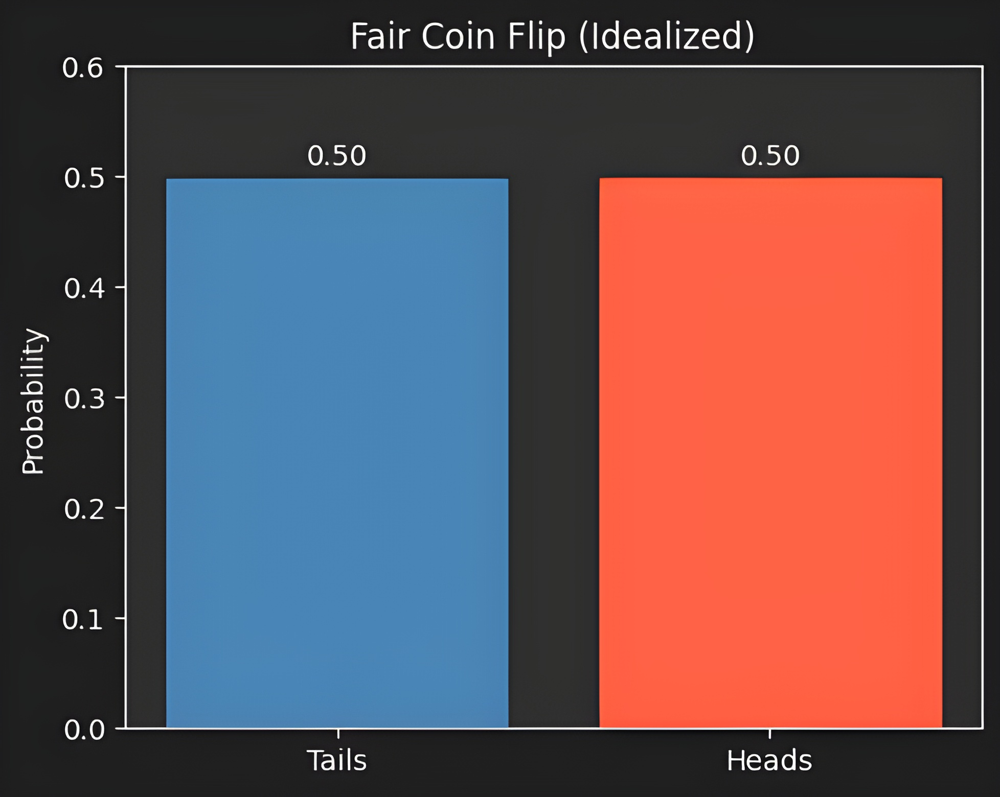
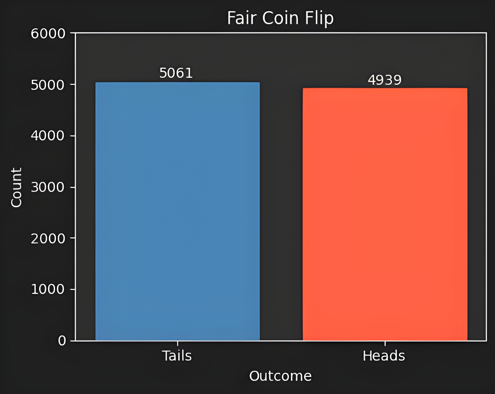
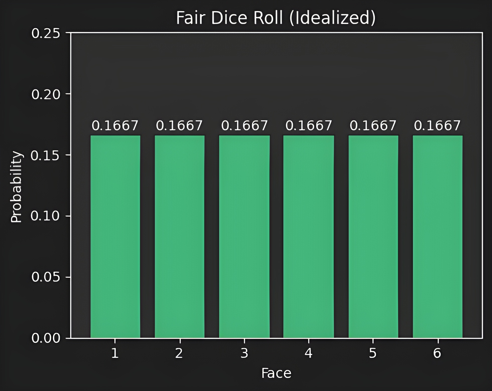
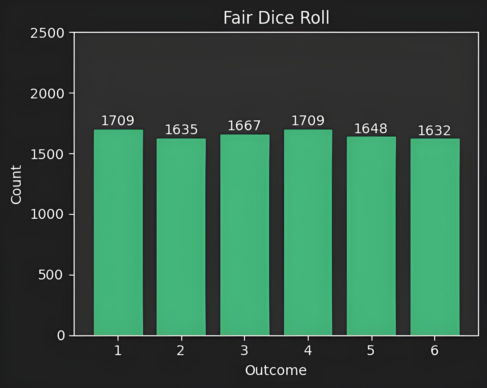
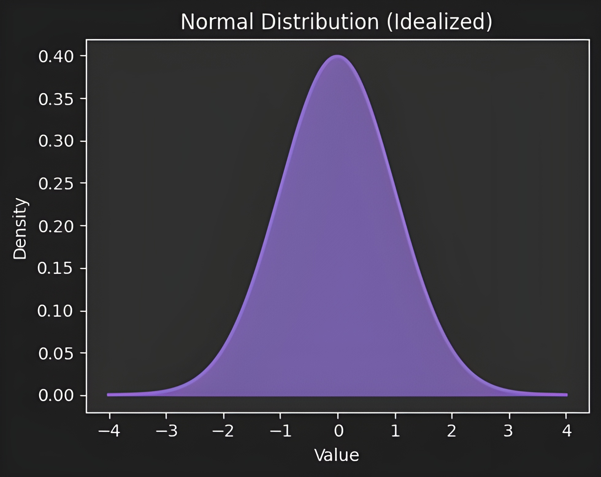

# Mediocrestan and Extremistan

This repository contains the code, Monte Carlo simulations, and plot generation for a blog post exploring the concepts of **Mediocrestan** and **Extremistan** from Nassim Nicholas Taleb's *Incerto* series. The notebook crystalizes some basic statistical concepts for the uninitiated.

# Visuals

## Idealized Coin Flip

## Simulated Coin Flip

## Idealized Dice Roll

## Simulated Dice Roll

### Idealized Normal Distribution

